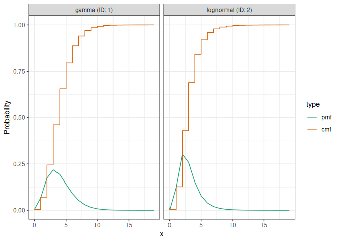

<!-- README.md is generated from README.Rmd. Please edit that file -->

# distspec: probability distributions with certain or uncertain parameters

<!-- badges: start -->

[](https://github.com/epiforecasts/distspec/actions/workflows/R-CMD-check.yaml)
[](https://app.codecov.io/gh/epiforecasts/distspec)
<!-- badges: end -->

distspec represents a probability distribution as a single object, a
`<dist_spec>`, whose parameters can be either fixed or uncertain. It
grew out of [EpiNow2](https://epiforecasts.io/EpiNow2/) and targets the
delay distributions that recur in infectious disease modelling —
generation times, incubation periods, reporting delays — while remaining
independent of any particular model.

With distspec you can:

- define a distribution with a named constructor (`Gamma()`,
  `LogNormal()`, `Normal()`, `Exponential()`, `Weibull()`, `Beta()`,
  `Fixed()` or `NonParametric()`), by its natural parameters or by its
  mean and standard deviation;
- give any parameter an uncertain prior (for example
  `Gamma(shape = Normal(2, 0.5), rate = 1)`), or leave a nonparametric
  mass function to be estimated during model fitting via a `Dirichlet()`
  prior;
- discretise a continuous distribution to a probability mass function
  (`discretise()`), convolve distributions (`+`, `collapse()`), draw
  samples (`sample_dist()`), and query means, standard deviations,
  bounds and PMFs.

## Installation

Install the development version from GitHub:

``` r
# install.packages("remotes")
remotes::install_github("epiforecasts/distspec")
```

## Quick start

``` r
library(distspec)
#> 
#> Attaching package: 'distspec'
#> The following objects are masked from 'package:stats':
#> 
#>     Gamma, sd

# A gamma delay with mean 4 and standard deviation 2, truncated at 20
delay <- Gamma(mean = 4, sd = 2, max = 20)
delay
#> - gamma distribution (max: 20):
#>   shape:
#>     4
#>   rate:
#>     1

# Add two delays with `+` to convolve them into one composite distribution
combined <- delay + LogNormal(meanlog = 1, sdlog = 0.5, max = 20)

# Discretise, collapse and read off the combined probability mass function
get_pmf(collapse(discretise(combined)))
#>  [1] 1.575639e-05 7.774458e-04 1.014705e-02 4.346165e-02 9.800319e-02
#>  [6] 1.456661e-01 1.643242e-01 1.534134e-01 1.251838e-01 9.253855e-02
#> [11] 6.351282e-02 4.119038e-02 2.557434e-02 1.535600e-02 8.989614e-03
#> [16] 5.165638e-03 2.930517e-03 1.649767e-03 9.258817e-04 5.201756e-04
#> [21] 2.935802e-04 1.657837e-04 9.204736e-05 4.981584e-05 2.623759e-05
#> [26] 1.344782e-05 6.713756e-06 3.270010e-06 1.556508e-06 7.251518e-07
#> [31] 3.310044e-07 1.480833e-07 6.488306e-08 2.777755e-08 1.156102e-08
#> [36] 4.630397e-09 1.747153e-09 5.903038e-10 1.510470e-10

# A parameter can itself be a distribution, expressing uncertainty
Gamma(shape = Normal(2, 0.5), rate = 1)
#> - gamma distribution:
#>   shape:
#>     - normal distribution:
#>       mean:
#>         2
#>       sd:
#>         0.5
#>   rate:
#>     1
```

`plot()` shows the probability mass and cumulative distribution
functions, one facet per component:

``` r
plot(combined)
```



See `vignette("distspec")` to get started, and the [reference
index](https://epiforecasts.io/distspec/reference/) for the full list of
functions.

## Contributors

<!-- ALL-CONTRIBUTORS-LIST:START - Do not remove or modify this section -->
<!-- prettier-ignore-start -->
<!-- markdownlint-disable -->

All contributions to this project are gratefully acknowledged using the
[`allcontributors` package](https://github.com/ropensci/allcontributors)
following the [all-contributors](https://allcontributors.org)
specification. Contributions of any kind are welcome!

### Code

<a href="https://github.com/epiforecasts/distspec/commits?author=sbfnk">sbfnk</a>,
<a href="https://github.com/epiforecasts/distspec/commits?author=dependabot[bot]">dependabot\[bot\]</a>,
<a href="https://github.com/epiforecasts/distspec/commits?author=github-merge-queue[bot]">github-merge-queue\[bot\]</a>,
<a href="https://github.com/epiforecasts/distspec/commits?author=seabbs">seabbs</a>,
<a href="https://github.com/epiforecasts/distspec/commits?author=github-actions[bot]">github-actions\[bot\]</a>

### Issues

<a href="https://github.com/epiforecasts/distspec/issues?q=is%3Aissue+author%3Ajamesmbaazam">jamesmbaazam</a>

<!-- markdownlint-enable -->
<!-- prettier-ignore-end -->
<!-- ALL-CONTRIBUTORS-LIST:END -->
